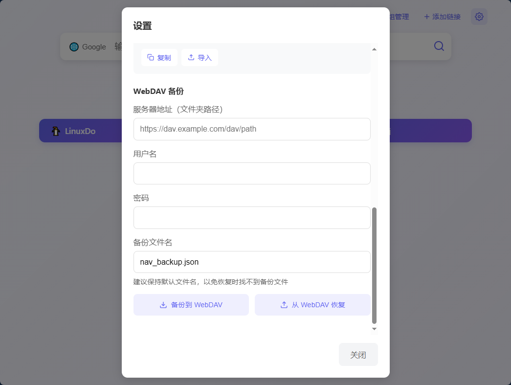

# KenNav 导航页

## 在线地址

主地址：https://nav.86440883.xyz/

备用地址：https://nav.hiken.me

GitHubPages：https://akenclub.github.io/KenNav/

## 介绍

一个轻量级的自定义浏览器导航页面，具有以下特点：

- 🔍 支持多搜索引擎快速切换

- 📑 可自定义书签分组，支持拖拽排序

- 💾 使用本地存储保存用户配置

- 📱 自适应桌面端和移动端

- 🔄 支持导入导出配置

- ☁️ 集成 WebDAV 备份功能

- 🎨 简洁现代的界面设计

## 浏览器兼容性

为了获得最佳使用体验，推荐使用以下浏览器：

### 桌面端
- Google Chrome
- Microsoft Edge
- Firefox

### 移动端
- Chrome for Android/iOS
- Edge for Android/iOS
- Safari (iOS)

⚠️ **已知问题**：
- 在一些轻量级浏览器（如 Via）上可能存在以下限制：
  - 导出配置时可能无法正常下载文件
  - 长按导航链接可能无法唤出上下文菜单
  - 部分功能可能无法正常工作

如遇到上述问题，建议更换为 Chrome、Edge 等主流浏览器使用。

## 截图

桌面端

移动端

## 本地开发

1. 克隆仓库后直接在浏览器中打开 index.html 即可
2. 修改代码后刷新页面即可看到效果
3. 建议使用 Live Server 等工具提供实时预览

## 技术栈与开发心得

### 技术选择
- 原生 JavaScript（无框架）
- HTML5 & CSS3
- Local Storage API

### 开发工具
本项目主要使用 [Cursor](https://www.cursor.com/) 进行开发。这是一个基于 AI 的编程工具，在开发过程中给了我很大帮助。

### 开发体会

在开发这个导航页的过程中，我尝试了使用 AI 辅助编程的新方式。说实话，这种体验很有趣，就像有了一个会写代码的助手。

Cursor 确实帮我节省了不少时间，特别是在写 CSS 样式和一些基础功能的时候。比如我想要一个 CSS 效果，只要简单描述一下需求，它就能给出还不错的代码。

不过在使用过程中也遇到一些小问题。有时候让它修改已有的代码时，它会直接新写一段，而不是在原有代码基础上改，这就导致了重复代码。后来发现，如果在提示时强调"在现有代码中修改"，效果会好很多。

最有意思的是，使用 AI 工具改变了我写代码的方式。我发现自己花在思考产品设计和用户体验上的时间变多了，因为实现功能变得更快了。与其说是在编程，不如说更像是在和 AI 一起设计产品。

虽然 AI 工具还不够完美，但确实让编程变得更轻松有趣了。关键是要学会如何更好地使用它，让它成为得力助手而不是完全依赖它。

## 贡献

欢迎提交 Issue 和 Pull Request。

## 许可证

本项目采用 [MIT 许可证](LICENSE)。